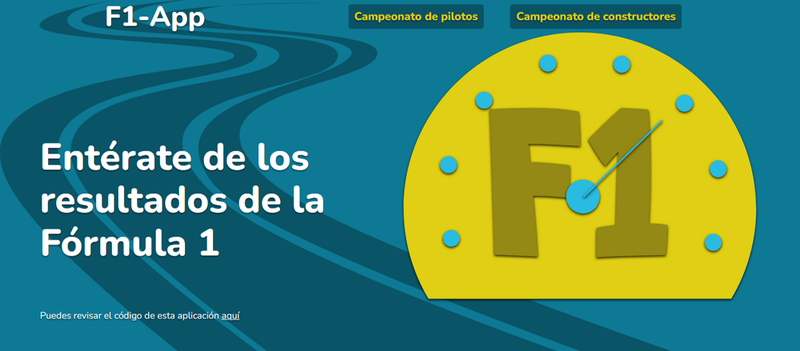

# F1-App

Aplicación que muestra una tabla con el campeonato de pilotos de la Fórmula 1 y otra con el
campeonato de constructores.

## Run

El proyecto está hecho con create-react-app, así que solo es necesario instalar los módulos de node que requiere la aplicación con "npm install".

## Consideraciones 

Para conseguir la información se utiliza una API llamada: [Ergast Developer API](http://ergast.com/mrd/)  .
  
  

